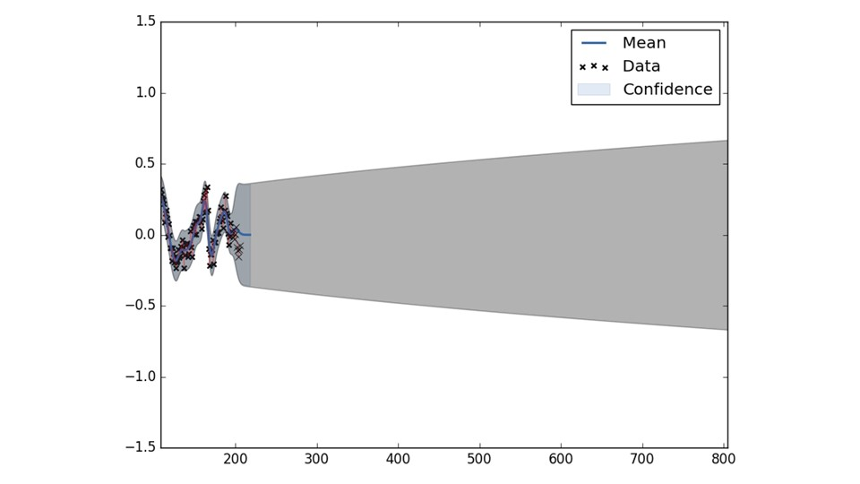

## Overview

**Author: Cagri Kilic 
Affiliation: [WVU NAVLAB](https://navigationlab.wvu.edu/) 
Maintainer: Cagri Kilic, cakilic@mix.wvu.edu**

Supplementary Kernel Function Selection analyses for the Slip-Based Autonomous ZUPT through Gaussian Process to Improve Planetary Rover Proprioceptive Localization paper.

The Kernel Functions are used from GPy Gaussian Process (GP) framework https://sheffieldml.github.io/GPy/ and scikit-learn https://scikit-learn.org/ libraries 

The first figure shows the kernel function(s) representation against the same slip data. The aim is heuristically find the best representation of the slip prediction over time. We assumed that slip could happen in two ways. 1) Randomly due to traversing over a rock, entering a pothole, or small local terrain imperfections, 2) continuously due to the mechanical properties of deformable terrains. These two slip behaviors can be represented as spikes for random slips and slowly increasing slip due to continuous slippage. 

## Kernel Functions

        

After careful consideration through mathematical expressions of the kernels, field tests, and simulation analyses, we have selected two kernel functions: Brownian Kernel to model random, high impulsive slippage, and Radial Basis Function Kernel to model continuous similar slip values. Then we have built the composite kernel model to capture both slippage behaviors during traversal as shown in second figure.

## Selected Composite Kernel

        

