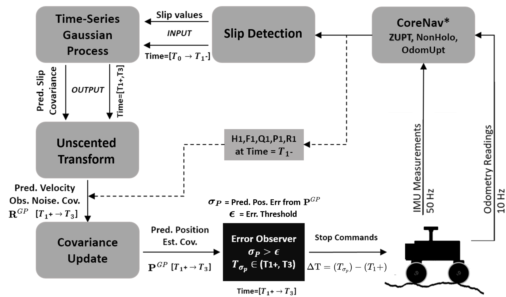

## Overview

**Author: Cagri Kilic 
Affiliation: [WVU NAVLAB](https://navigationlab.wvu.edu/) 
Maintainer: Cagri Kilic, cakilic@mix.wvu.edu**

Slip-Based Autonomous ZUPT through Gaussian Process to Improve Planetary Rover Localization

## Architecture

        

**Keywords:** Mars Sample Return, planetary rovers, time series prediction, slip, zero velocity update, rover localization

## Citation

If you find this library useful, please cite the following publication:

**[1]** Cagri Kilic, Nicholas Ohi, Yu Gu, Jason N. Gross: **Slip-Based Autonomous ZUPT through Gaussian Process to Improve Planetary Rover Localization**. IEEE Robotics and Automation Letters (RA-L), 2021. https://doi.org/10.1109/LRA.2021.3068893 

        @article{Kilic2020,
          author={Kilic, Cagri and Ohi, Nicholas and and Gu, Yu and Gross, Jason N},
          journal={IEEE Robotics and Automation Letters}, 
          title={Slip-Based Autonomous ZUPT through Gaussian Process to Improve Planetary Rover Localization}, 
          year={2021},
          volume={},
          number={},
          pages={1-1},
          doi={10.1109/LRA.2021.3068893}
          }

**[2]** Cagri Kilic and Jason Gross: **Pathfinder GPS, IMU, and Wheel Odometry Data on Various Terrains**, IEEE Dataport, November 23, 2020, doi: https://dx.doi.org/10.21227/vz7z-jc84. 

        @data{Kilic2020Pathfinder,
           doi = {10.21227/vz7z-jc84},
           url = {https://dx.doi.org/10.21227/vz7z-jc84},
           author = {Cagri Kilic; Jason Gross },
           publisher = {IEEE Dataport},
           title = {Pathfinder GPS, IMU, and Wheel Odometry Data on Various Terrains},
           year = {2020} } 
            
        }

**[3]** Cagri Kilic, Jason N. Gross, Nicholas Ohi, Ryan Watson, Jared Strader, Thomas Swiger, Scott Harper, and Yu Gu: **Improved Planetary Rover Inertial Navigation and Wheel Odometry Performance through Periodic Use of Zero-Type Constraints**. IEEE/RSJ International Conference on Intelligent Robots and Systems (IROS), 2019. https://doi.org/10.1109/IROS40897.2019.8967634

        @inproceedings{Kilic2019,
            author = {Kilic, Cagri and Gross, Jason N. and Ohi, Nicholas and Watson, Ryan and Strader, Jared and Swiger, Thomas and Harper, Scott and Gu, Yu},
            booktitle = {2019 IEEE/RSJ International Conference on Intelligent Robots and Systems (IROS)},
            title = {{Improved Planetary Rover Inertial Navigation and Wheel Odometry Performance through Periodic Use of Zero-Type Constraints}},
            year = {2019},
            pages={552-559},
            doi={10.1109/IROS40897.2019.8967634},
            ISSN={2153-0858}, 
            publisher = {IEEE},
            
        }
