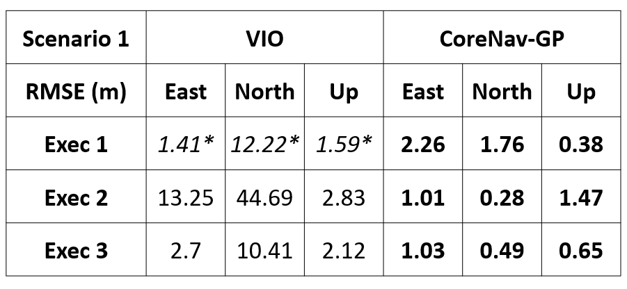

## Overview

**Author: Cagri Kilic 
Affiliation: [WVU NAVLAB](https://navigationlab.wvu.edu/) 
Maintainer: Cagri Kilic, cakilic@mix.wvu.edu**

Supplementary Visual-Inertial Odometry (VIO) Analyses in low-feature environment for the Slip-Based Autonomous ZUPT through Gaussian Process to Improve Planetary Rover Proprioceptive Localization paper.

The VIO solution is generated using ROS Wrapper for Intel® RealSense™ Devices https://github.com/IntelRealSense/realsense-ros

Each figure provides a DGPS solution, filter estimation (corenav-GP solution), 2D Dead Reckoning (only WO and IMU heading). The Google Map representation of the ground truth (DGPS) solution is provided to visualize the low-feature environment (Point Marion, PA, Ashpiles Mars Analog Environment). Solution accuracy values are given for the corenav-GP implementation.
 
### Scenario 1, Execution 1

        

*VIO failed after traversing 124m

### Scenario 1, Execution 2

        

### Scenario 1, Execution 3

        

### Scenario 1 Analysis

        

The median values (out of 3 execution) of RMSE for CoreNav-GP are E=1.03m, N=0.49m, U=0.65m

The median values (out of 3 execution) of RMSE for VIO are E=2.70m, N=12.22*, U=2.12m 

In Execution 1, there is only 124m out of 150m traversed solution for VIO. After 124m, VIO failed and outputs NaN values. For this reason, the star (*) values show the accuracy until 124 m.

### Additional Scenario 1

        

The values of RMSE for CoreNav-GP are E=0.66m, N=0.40m, U=2.89m

The  values of RMSE for VIO are E=13.27m, N=56.62m, U=2.12m 

### Additional Scenario 2

   

The values of RMSE for CoreNav-GP are E=1.23m, N=2.51m, U=1.97m 

The values of RMSE for VIO are E=44.04m, N=27.24m, U=0.42m     

