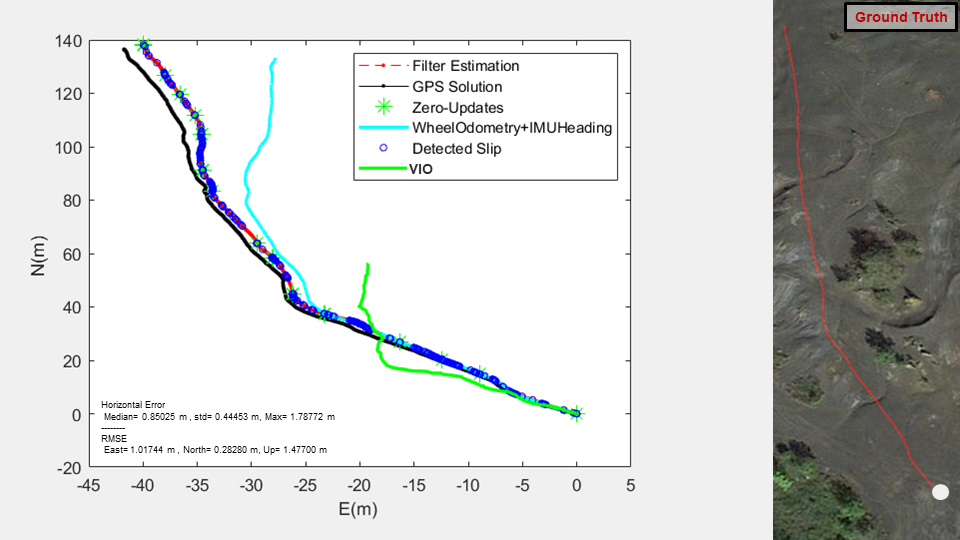
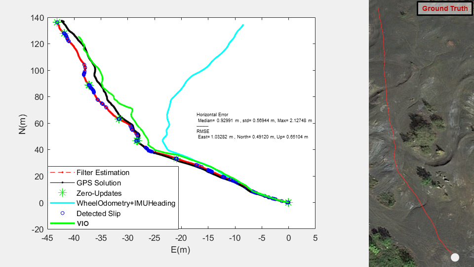
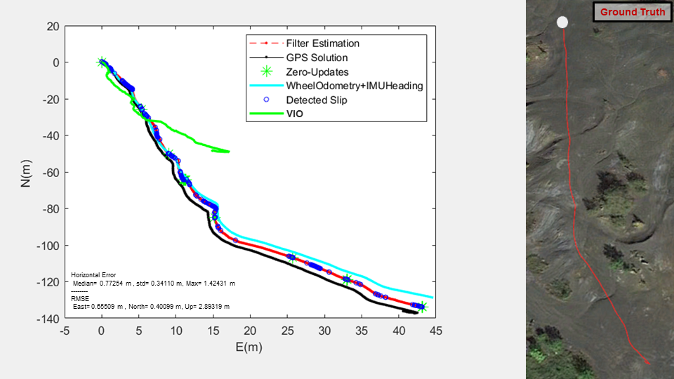
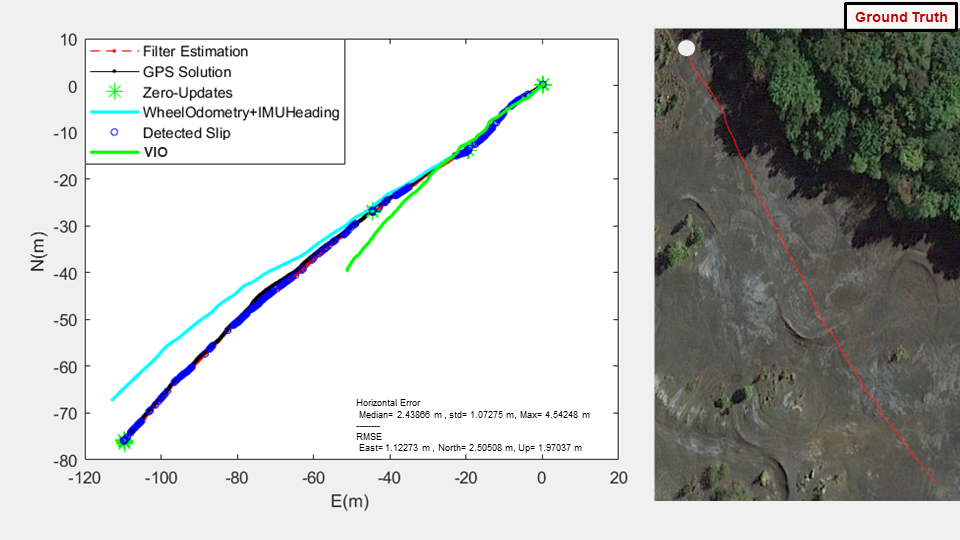

## Overview

**Author: Cagri Kilic 
Affiliation: [WVU NAVLAB](https://navigationlab.wvu.edu/) 
Maintainer: Cagri Kilic, cakilic@mix.wvu.edu**

Supplementary Visual-Inertial Odometry (VIO) Analyses in low-feature environment for the Slip-Based Autonomous ZUPT through Gaussian Process to Improve Planetary Rover Proprioceptive Localization paper.

The VIO solution is generated using ROS Wrapper for Intel® RealSense™ Devices https://github.com/IntelRealSense/realsense-ros

Each figure provides a DGPS solution, filter estimation (corenav-GP solution), 2D Dead Reckoning (only WO and IMU heading). The Google Map representation of the ground truth (DGPS) solution is provided to visualize the low-feature environment (Point Marion, PA, Ashpiles Mars Analog Environment). Solution accuracy values are given for the corenav-GP implementation.
 
### Scenario 1, Execution 1

        

*VIO failed after traversing 124m

### Scenario 1, Execution 2

        

### Scenario 1, Execution 3

        

### Additional Scenario 1

        

### Additional Scenario 2

        

