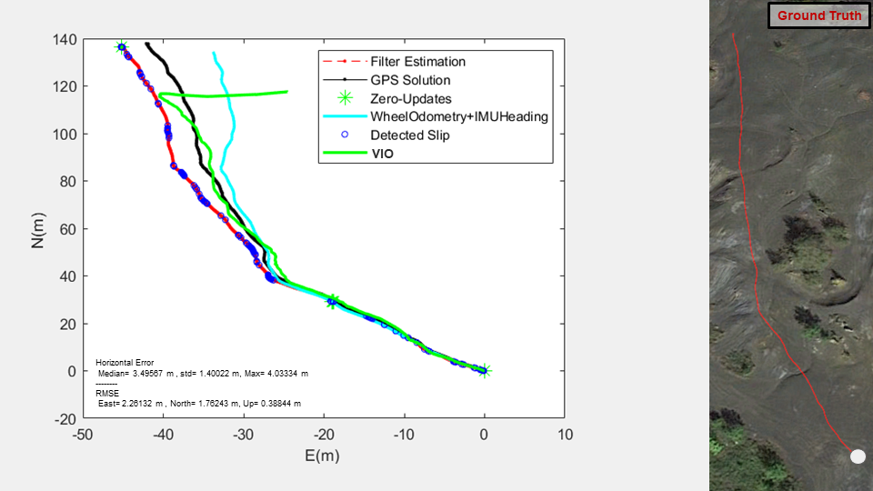

## Overview

**Author: Cagri Kilic 
Affiliation: [WVU NAVLAB](https://navigationlab.wvu.edu/) 
Maintainer: Cagri Kilic, cakilic@mix.wvu.edu**

Slip-Based Autonomous ZUPT through Gaussian Process to Improve Planetary Rover Proprioceptive Localization

## Architecture

        

**Keywords:** Mars Sample Return, planetary rovers, time series prediction, slip, zero velocity update, rover localization

